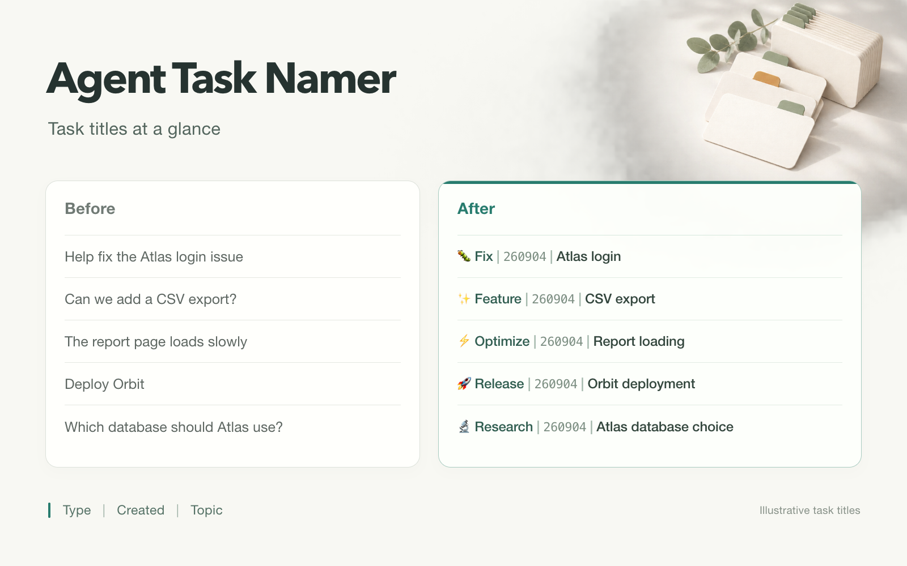

# Agent Task Namer

[简体中文](README.zh-CN.md)

Automatically add a type, creation date, and topic to Codex task titles, so you can find them in the sidebar.



*Illustrative comparison of the same tasks using consistent type, creation date, and topic.*

```text
🐛 Fix | 260904 | Login callback failure
📝 Docs | 260904 | Atlas deployment guide
⚡ 优化 | 260904 | 登录页面布局
```

Each title follows the language of that task's main request. Dates use the task's creation day in Beijing time by default and stay the same when you continue chatting. Titles you explicitly chose are preserved.

## Get started in Codex

For **local tasks in Codex desktop**, with official task read and rename tools available. Automatic naming also requires **Python 3** and the one-time setup below.

Install the plugin by adding this public GitHub repository as a Codex repository marketplace. Run:

```sh
codex plugin marketplace add deronendless/agent-task-namer
codex plugin add agent-task-namer@agent-task-namer
```

Restart Codex. Open **Plugins**, select **Agent Task Namer**, review the bundled startup Hook, and choose **Trust all**.

If repository marketplaces are unavailable, install the standalone Skill by sending this to Codex:

```text
Install the agent-task-namer skill from https://github.com/deronendless/agent-task-namer/tree/v0.1.5/skills/agent-task-namer
```

After installation, try naming the current task:

```text
$agent-task-namer Rename this task using the standard format.
```

Your sidebar title should change to the format shown above. Already accurate titles are kept; without a reliable creation time, you get a type and topic draft instead of a guessed date.

## Name new tasks automatically

The plugin already includes the automatic-naming Hook, so it needs no separate Hook configuration after you trust it.

If you installed the standalone Skill, send:

```text
$agent-task-namer Enable automatic naming for new tasks.
```

Complete the client's initial hook trust prompt, then create a new local task and make a normal request, such as “Help me fix the login error.” Naming runs once that task's first substantive request is clear; opening an empty task does not name it. Continuing or resuming an existing task does not trigger a new automatic rename.

Do not enable both the plugin and standalone naming Hooks, because they would emit duplicate reminders. See [setup and migration](skills/agent-task-namer/references/automatic.md) when switching installation methods.

If naming does not work, send:

```text
$agent-task-namer Check why automatic task naming is not working.
```

See [troubleshooting](skills/agent-task-namer/references/troubleshooting.md) for checks and next steps.

## More ways to use it

The plugin page offers three starters: **name this task**, **preview project titles**, and **diagnose automatic naming**. Preview does not apply changes.

- **Preview or organize Codex tasks:** ask `$agent-task-namer` to “Preview new titles without applying them” or “Organize the titles of all tasks in this project.” [Batch rename and restore](skills/agent-task-namer/references/batch.md).
- **Change the language:** ask “Translate this task's title into English, keeping the format.”
- **Claude Code local CLI (experimental):** copy `skills/agent-task-namer/` to `~/.claude/skills/agent-task-namer/`, [set up the optional SDK](skills/agent-task-namer/references/automatic.md#claude-code-local-cli-setup), then use `/agent-task-namer Rename this session using the standard format.` End-to-end validation is pending; batch and restore are not included.
- **Other agents:** load the [Skill](skills/agent-task-namer/SKILL.md) and ask for a title suggestion. Direct renaming is not included.

## Validation

Run the offline checks from the repository root:

```sh
python3 -m unittest discover -s skills/agent-task-namer/scripts
python3 -m unittest discover -s hooks
python3 skills/agent-task-namer/scripts/eval_cases.py check
```

The structured cases cover naming eligibility, languages, dates, and readback failures. `check` validates case structure only. See [behavior evaluation](skills/agent-task-namer/references/validation.md) for blind simulated traces and separate live-client checks.

---

[Detailed rules](skills/agent-task-namer/SKILL.md) · [MIT License](LICENSE)

Community skill; not an official OpenAI or Anthropic product.
