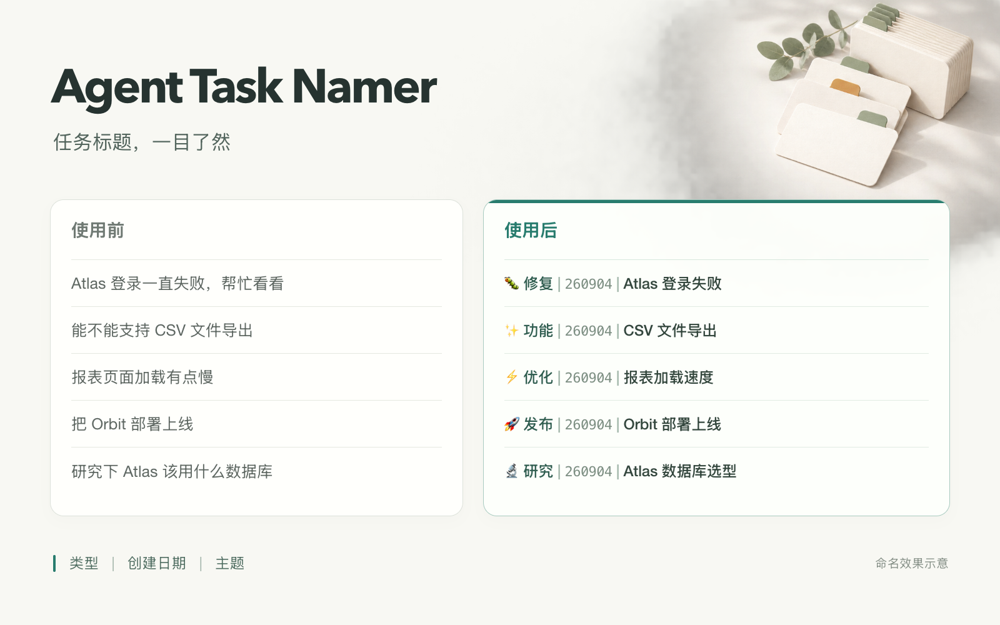

# Agent Task Namer

[English](README.md)

给 Agent 任务统一命名，让任务更好找。支持 Codex、Claude Code 本地 CLI，以及其他 Agent 的标题建议。



*命名效果示意：同一组任务，统一类型、创建日期与主题。*

```text
🐛 修复 | 260904 | 登录回调失败
📝 文档 | 260904 | Atlas 部署教程
🐛 Fix | 260904 | Login callback failure
```

标题跟随各任务主要提问的语言。日期使用任务创建当天，默认按北京时间计算，续聊不变。

| 客户端 | 当前任务改名 | 可选自动命名 | 批量整理与恢复 |
|---|---|---|---|
| Codex（需要官方任务工具） | 支持 | 支持 | 支持 |
| Claude Code 本地 CLI（需要可选 SDK） | 实验性支持 | 实验性支持 | 暂不支持 |
| 其他能读取 Skill 的 Agent | 仅标题建议 | 暂不支持 | 暂不支持 |

Claude Code 适配为实验性支持，完整流程仍待验证。

## 1. 安装

Codex 自动命名还提供插件形式，包含 Skill 和启动 Hook。本仓库可作为插件源，按[官方市场分发流程](https://developers.openai.com/plugins/build/plugins#how-local-marketplaces-work)分发；目前尚未发布市场条目。

原独立 Skill 安装方式继续支持。把这句话发给你使用的 Agent：

```text
请从 https://github.com/deronendless/agent-task-namer/tree/main/skills/agent-task-namer 安装 agent-task-namer 这个 Skill。
```

Claude Code 将仓库中的 `skills/agent-task-namer/` 目录复制到 `~/.claude/skills/agent-task-namer/`，实际改名还需[安装可选 SDK](skills/agent-task-namer/references/automatic.md#claude-code-local-cli-setup)。其他 Agent 按其 Skill 安装方式加载，或直接读取 [skills/agent-task-namer/SKILL.md](skills/agent-task-namer/SKILL.md)。仓库名、Skill 目录名和调用标识统一为 `agent-task-namer`。

## 2. 使用

**Codex：给当前任务改名**

```text
$agent-task-namer 按规范重命名当前任务。
```

**Claude Code：给当前会话改名**

```text
/agent-task-namer 按规范重命名当前会话。
```

**其他 Agent：生成建议**

```text
读取仓库中的 skills/agent-task-namer/SKILL.md，按本任务的主要请求生成标题建议。
```

缺少可靠创建时间时只生成类型和主题草稿，不猜日期。

在 Codex 中整理项目任务时，可以让 `$agent-task-namer` “预览新标题，先不要执行改名”，或“整理当前项目的所有任务命名”。

已经准确合规、或由你明确指定的标题会保留。想切换语言，直接说：“保留格式，把当前任务标题改成英文。”

## 可选：新任务自动命名

**Codex 插件：**安装后会自动发现自带 Hook，无需编辑 `hooks.json`。在插件详情页审阅 Hook 并点击一次 **Trust all**，之后新任务无需再次配置。Hook 定义变动时可能需要重新审阅；安装插件本身不会授予 Hook 信任。

**独立 Skill 或 Claude Code：**把这句话发给你使用的 Agent：

```text
帮我启用 agent-task-namer 的新任务自动命名。
```

独立 Skill 仍需单独配置 Hook，并完成客户端的信任流程。迁移到 Codex 插件时，移除原有命名 Hook，避免重复提醒。[查看配置与迁移详情](skills/agent-task-namer/references/automatic.md)。

## 目录结构

```text
.codex-plugin/           插件清单
hooks/                  Codex 插件启动 Hook 配置
skills/agent-task-namer/ 独立 Skill、脚本与参考文档
assets/readme/          README 配图与图片源文件
```

---

[完整规则](skills/agent-task-namer/SKILL.md) · [批量改名与恢复](skills/agent-task-namer/references/batch.md) · [MIT 许可证](LICENSE)

完整规则与参考文档使用英文。社区 Skill，非 OpenAI 或 Anthropic 官方产品。
